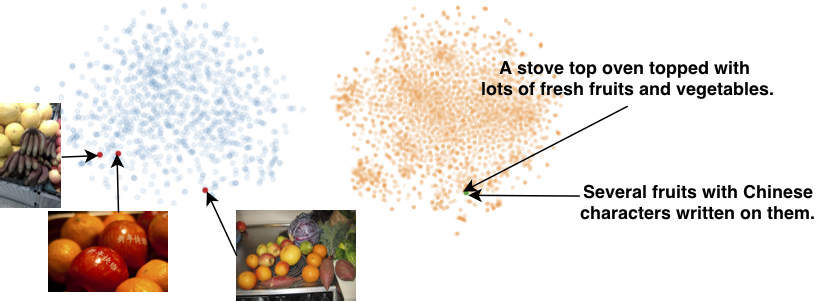

# Joint Wasserstein Autoencoders for Aligning Multimodal Embeddings

<p align="center">
  
  
</p>

This repository is the PyTorch implementation of the paper:

[**Joint Wasserstein Autoencoders for Aligning Multimodal Embeddings (ICCV Worshops 2019)**](https://openaccess.thecvf.com/content_ICCVW_2019/papers/CROMOL/Mahajan_Joint_Wasserstein_Autoencoders_for_Aligning_Multimodal_Embeddings_ICCVW_2019_paper.pdf)

[Shweta Mahajan](https://www.visinf.tu-darmstadt.de/visinf/team_members/smahajan/smahajan.en.jsp), [Teresa Botschen](https://www.linkedin.com/in/dr-teresa-botschen-823971a9/?originalSubdomain=de), [Iryna Gurevych](https://www.informatik.tu-darmstadt.de/ukp/ukp_home/head_ukp/index.en.jsp) and [Stefan Roth](https://www.visinf.tu-darmstadt.de/visinf/team_members/sroth/sroth.en.jsp)

This repository is built on top of [SCAN](https://github.com/kuanghuei/SCAN) and [VSE++](https://github.com/fartashf/vsepp) in PyTorch.


## Requirements
The following code is written in Python 2.7.0 and CUDA 9.0.

Requirements:
- torch 0.3
- torchvision 0.3.0
- nltk 3.5
- gensim
- Punkt Sentence Tokenizer:

```
import nltk
nltk.download()
> d punkt
```

To install requirements:

```setup
conda config --add channels pytorch
conda config --add channels anaconda
conda config --add channels conda-forge
conda config --add channels conda-forge/label/cf202003
conda create -n <environment_name> --file requirements.txt
conda activate <environment_name>
```

## Preprocessed data

1. The preprocessed COCO and Flickr30K dataset used in the experiments are based on the [SCAN](https://github.com/kuanghuei/SCAN) and can be downloaded at [COCO_Precomp](https://download.visinf.informatik.tu-darmstadt.de//data/2019-iccvw-mahajan-jwae/coco_precomp/coco_precomp.tar.gz) and [F30k_Precomp](https://download.visinf.informatik.tu-darmstadt.de//data/2019-iccvw-mahajan-jwae/f30k_precomp.tar.gz).
The downloaded dataset should be placed in the ```data``` folder.

2. Run ```vocab.py``` to generate the vocabulary for the datasets as:

```
python vocab.py --data_path data --data_name f30k_precomp
python vocab.py --data_path data --data_name coco_precomp
``` 

## Training

A new JWAE model can be trained using the following:

 ```
		python train.py --data_path "$DATA_PATH" --data_name coco_precomp --vocab_path "$VOCAB_PATH"
 ```

## Evaluation

The trained model can then be evaluated using the following python script:

```
from vocab import Vocabulary
import evaluation
evaluation.evalrank("$CHECKPOINT_PATH", data_path="$DATA_PATH", split="test")
```

## Bibtex
```
@inproceedings{Mahajan:2019:JWA,
  author = {Shweta Mahajan and Teresa Botschen and Iryna Gurevych and Stefan Roth},
  booktitle = {ICCV Workshop on Cross-Modal Learning in Real World},
  title = {Joint {W}asserstein Autoencoders for Aligning Multi-modal Embeddings},
  year = {2019}
}
```
